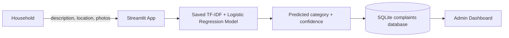

# Isuku Waste Complaint Classifier

An NLP system for cleaner communities and faster waste-service response

<strong>Project goal</strong> 
Help households submit clear complaints and automatically classify them for administrators.

**Built with:** Python · scikit-learn · Streamlit · SQLite · Jupyter Notebook

---

## 1. The Problem

Waste complaints arrive in many different forms:

- Missed or delayed collection
- Full household or communal bins
- Illegal dumping reports
- Recycling and reuse questions

A manual process makes it harder to prioritize complaints and identify recurring service problems.

<strong>Solution:</strong> Let residents describe the issue naturally, then use NLP to assign a consistent category.

---

## 2. Data and Model

### Training workflow

1. Load and validate the labeled complaint dataset
2. Clean text by lowercasing, removing URLs/punctuation, and normalizing spaces
3. Add representative paraphrases for real-world wording
4. Extract word and character TF-IDF features
5. Train Logistic Regression in a scikit-learn pipeline
6. Evaluate and save the complete model pipeline

### Categories

`missed_pickup` · `delayed_pickup` · `full_bin` · `illegal_dumping` · `recycling_question`

---

## 3. Application Architecture

- **Household page:** submit a complaint and see its classification
- **Model layer:** loads `model/waste_complaint_classifier.joblib`
- **Database layer:** stores description, location, prediction, status, and photos
- **Admin page:** displays all submitted complaints, metrics, badges, and category summaries

---

## 4. Results

The final notebook evaluation achieved:

<strong>Accuracy: 100%</strong> 
<strong>Weighted precision: 100%</strong> 
<strong>Weighted recall: 100%</strong> 
<strong>Weighted F1-score: 100%</strong>

The model also handles paraphrases outside the original wording, for example:

> “It has been weeks since they picked the waste materials here in Nyarugenge. Can you please send someone?”

Classification: **Missed Pickup**

---

## 5. Demo: Submit and Track a Complaint

### Live demonstration

1. Open the Streamlit app:
   `streamlit run streamlit_app.py`
2. Select **Household** in the sidebar
3. Enter a complaint description, location, and optional photos
4. Click **Submit Complaint**
5. Show the AI classification and confidence result
6. Select **Admin** in the sidebar
7. Show the same complaint in the dashboard table and category metrics

### Demo example

**Input:** “The bin outside our house is completely full. It needs urgent collection.”

**Expected classification:** `Full Bin`

The household submission and admin dashboard use the same stored record, so the result is reflected immediately.

